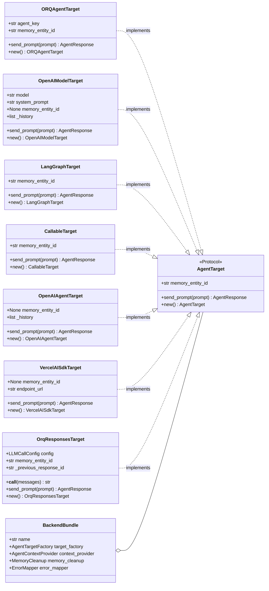
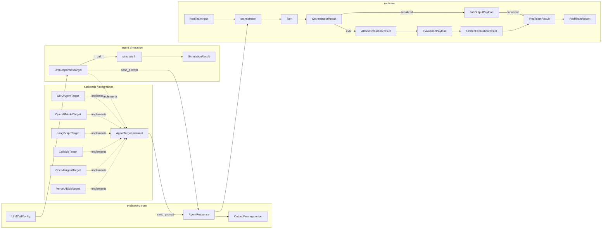

# Types UML — evaluatorq / redteam / agent simulation

Four regions share one bridge: `AgentResponse`. Evaluatorq core owns the unified output contract; redteam owns the `AgentTarget` protocol, orchestration models, and job I/O boundary (`JobOutputPayload`); backends/integrations provide target implementations; agent simulation owns persona/scenario/result models.

## Class diagram — core & redteam contracts

```mermaid
classDiagram
    direction TB

    %% ── EVALUATORQ CORE ──────────────────────────────
    class LLMCallConfig {
        +str model
        +Literal[chat_completions,responses] api
        +float temperature
        +int max_tokens
        +int timeout_ms
        +dict extra_kwargs
        +Any client
    }
    class AgentResponse {
        +list~OutputMessage~ output
        +Any usage
        +str model
        +str response_id
        +str finish_reason
        +text() str
        +tool_calls() list~ToolCallOutputItem~
    }
    class OutputMessage {
        <<Union>>
    }
    class TextOutputItem {
        +type: output_text
        +str text
        +list annotations
        +list logprobs
    }
    class ToolCallOutputItem {
        +type: function_call
        +str id
        +str call_id
        +str name
        +str arguments
        +FunctionCallStatus status
        +str result
        +arguments_dict() dict
    }
    class ReasoningOutputItem {
        +type: reasoning
        +str text
        +str id
    }

    OutputMessage <|.. TextOutputItem
    OutputMessage <|.. ToolCallOutputItem
    OutputMessage <|.. ReasoningOutputItem
    AgentResponse "1" *-- "many" OutputMessage
    AgentResponse ..> ToolCallOutputItem : filters in tool_calls

    %% ── REDTEAM — CONVERSATION TYPES ────────────────
    class Message {
        +Literal[user,assistant,tool,system] role
        +str content
        +list~StrategyToolCall~ tool_calls
        +str tool_call_id
        +str name
    }
    class AttackerResponse {
        +str generated_prompt
        +TokenUsage usage
        +bool truncated
        +str finish_reason
    }
    class Turn {
        +AttackerResponse attacker
        +AgentResponse target
    }
    class RedTeamInput {
        +str id
        +str vulnerability
        +str category
        +str attack_technique
        +str delivery_method
        +Severity severity
        +VulnerabilityDomain vulnerability_domain
        +Framework framework
        +str evaluator_id
        +str evaluator_name
        +TurnType turn_type
        +str source
        +dict additional_metadata
    }
    class AgentContext {
        +str key
        +str display_name
        +str description
        +str system_prompt
        +str instructions
        +list~ToolInfo~ tools
        +list~MemoryStoreInfo~ memory_stores
        +list~KnowledgeBaseInfo~ knowledge_bases
        +str model
        +has_tools() bool
        +has_memory() bool
    }

    Turn *-- AttackerResponse
    Turn *-- AgentResponse

    %% ── REDTEAM — ORCHESTRATION ──────────────────────
    class LLMConfig {
        +LLMCallConfig attacker
        +LLMCallConfig evaluator
        +int retry_count
        +list~int~ retry_on_codes
        +int cleanup_timeout_ms
        +int target_agent_timeout_ms
        +int max_tool_continuations
        +retry_config() dict
    }
    class TokenUsage_RT {
        +int total_tokens
        +int prompt_tokens
        +int completion_tokens
        +int calls
        +from_completion(response) TokenUsage
        +__add__(other) TokenUsage
    }
    class OrchestratorResult {
        +list~Turn~ turns
        +bool objective_achieved
        +float duration_seconds
        +TokenUsage token_usage
        +TokenUsage token_usage_adversarial
        +TokenUsage token_usage_target
        +str system_prompt
        +int max_turns
        +str error
        +str error_type
        +str error_stage
        +str error_code
        +dict error_details
        +int error_turn
        +list~int~ truncated_turns
        +n_turns() int
        +conversation() list~Message~
        +final_response() str
    }
    class AttackOutput {
        +str category
        +str vulnerability
    }
    class ErrorInfo {
        +str message
        +str error_type
        +str stage
        +str code
        +dict details
        +int turn
    }

    LLMConfig *-- LLMCallConfig
    OrchestratorResult "1" *-- "many" Turn
    OrchestratorResult ..> TokenUsage_RT
    AttackOutput --|> OrchestratorResult

    %% ── REDTEAM — EVALUATION CHAIN ──────────────────
    class AttackEvaluationResult {
        +bool passed
        +str explanation
        +str evaluator_id
        +TokenUsage token_usage
        +dict raw_output
    }
    class EvaluationPayload {
        +str evaluator_id
        +str evaluator_name
        +Any value
        +str explanation
        +bool passed
        +str error
        +TokenUsage token_usage
    }
    class UnifiedEvaluationResult {
        +Any value
        +bool passed
        +str explanation
        +str evaluator_id
        +str evaluator_name
        +TokenUsage token_usage
        +dict raw_output
    }

    AttackEvaluationResult ..> EvaluationPayload : informs
    EvaluationPayload ..> UnifiedEvaluationResult : normalized to

    %% ── REDTEAM — JOB BOUNDARY + REPORT ─────────────
    class JobOutputPayload {
        +list~Message~ conversation
        +str final_response
        +str response
        +str output
        +int turns
        +int max_turns
        +bool objective_achieved
        +float duration_seconds
        +TokenUsage token_usage
        +TokenUsage token_usage_adversarial
        +TokenUsage token_usage_target
        +str system_prompt
        +str error
        +str error_type
        +str error_stage
        +str error_code
        +dict error_details
        +int error_turn
        +list~int~ truncated_turns
        +str finish_reason
        +response_text() str
    }
    class AttackInfo {
        +str id
        +str vulnerability
        +str category
        +Framework framework
        +AttackTechnique attack_technique
        +list~DeliveryMethod~ delivery_methods
        +TurnType turn_type
        +Severity severity
        +VulnerabilityDomain vulnerability_domain
        +str source
        +str strategy_name
        +str objective
        +str evaluator_id
        +str evaluator_name
        +dict additional_metadata
    }
    class AttackStrategy {
        +Vulnerability vulnerability
        +str category
        +str name
        +str description
        +AttackTechnique attack_technique
        +list~DeliveryMethod~ delivery_methods
        +TurnType turn_type
        +Severity severity
        +bool requires_tools
        +list~AgentCapability~ required_capabilities
        +str objective_template
        +str prompt_template
        +bool is_generated
    }
    class AgentInfo {
        +str key
        +str model
        +str display_name
    }
    class ExecutionDetails {
        +int turns
        +int max_turns
        +float duration_seconds
        +bool objective_achieved
        +TokenUsage token_usage
    }
    class RedTeamResult {
        +AttackInfo attack
        +AgentInfo agent
        +list~Message~ messages
        +str response
        +UnifiedEvaluationResult evaluation
        +bool vulnerable
        +ExecutionDetails execution
        +str error
        +str error_type
        +str error_stage
        +str error_code
        +dict error_details
        +error_info() ErrorInfo
    }
    class RedTeamReport {
        +str version
        +datetime created_at
        +str description
        +Pipeline pipeline
        +Framework framework
        +list~str~ categories_tested
        +list~str~ tested_agents
        +int total_results
        +AgentContext agent_context
        +dict~str,AgentContext~ agent_contexts
        +list~RedTeamResult~ results
        +ReportSummary summary
        +list~FocusAreaRecommendation~ focus_area_recommendations
        +TokenUsage token_usage_summary
        +float duration_seconds
        +list~str~ pipeline_warnings
    }

    OrchestratorResult ..> JobOutputPayload : serialized to
    JobOutputPayload "1" *-- "many" Message
    JobOutputPayload o-- ToolCallOutputItem
    JobOutputPayload ..> RedTeamResult : converted from
    RedTeamResult *-- AttackInfo
    RedTeamResult *-- AgentInfo
    RedTeamResult *-- UnifiedEvaluationResult
    RedTeamResult o-- ExecutionDetails
    RedTeamResult o-- ToolCallOutputItem
    RedTeamResult ..> ErrorInfo : error_info property
    RedTeamReport "1" *-- "many" RedTeamResult
    RedTeamReport o-- AgentContext
    RedTeamInput ..> AttackInfo : shapes

    %% ── AGENT SIMULATION ────────────────────────────
    class OrqResponsesTarget {
        +LLMCallConfig config
        +str instructions
        +list tools
        +str memory_entity_id
        +str _previous_response_id
        +TokenUsage _accumulated_usage
        +__call__(messages) str
        +send_prompt(prompt) AgentResponse
        +new() OrqResponsesTarget
    }
    class Persona {
        +str name
        +float patience
        +float assertiveness
        +float politeness
        +float technical_level
        +CommunicationStyle communication_style
        +str background
        +EmotionalArc emotional_arc
        +CulturalContext cultural_context
    }
    class Scenario {
        +str name
        +str goal
        +str context
        +StartingEmotion starting_emotion
        +list~Criterion~ criteria
        +bool is_edge_case
        +ConversationStrategy conversation_strategy
        +str ground_truth
        +InputFormat input_format
    }
    class Datapoint {
        +str id
        +Persona persona
        +Scenario scenario
        +str user_system_prompt
        +str first_message
    }
    class Judgment {
        +bool should_terminate
        +str reason
        +bool goal_achieved
        +list~str~ rules_broken
        +float goal_completion_score
        +float response_quality
        +float hallucination_risk
        +float tone_appropriateness
        +float factual_accuracy
    }
    class TurnMetrics {
        +int turn_number
        +TokenUsage token_usage
        +float response_quality
        +float hallucination_risk
        +float tone_appropriateness
        +float factual_accuracy
        +str judge_reason
    }
    class TokenUsage_Sim {
        +int prompt_tokens
        +int completion_tokens
        +int total_tokens
    }
    class SimulationResult {
        +list~Message~ messages
        +TerminatedBy terminated_by
        +str reason
        +bool goal_achieved
        +float goal_completion_score
        +list~str~ rules_broken
        +int turn_count
        +TokenUsage_Sim token_usage
        +list~TurnMetrics~ turn_metrics
        +dict metadata
        +dict~str,bool~ criteria_results
        +int total_turns
    }

    OrqResponsesTarget ..> AgentResponse : produces
    OrqResponsesTarget *-- LLMCallConfig
    Datapoint *-- Persona
    Datapoint *-- Scenario
    SimulationResult o-- TurnMetrics
    SimulationResult ..> TokenUsage_Sim
    TurnMetrics ..> Judgment
    TurnMetrics ..> TokenUsage_Sim
```

## Class diagram — backend & integration layer

## Data flow

## Ownership notes

- `AgentResponse`, `LLMCallConfig`, `ReasoningOutputItem` — canonical in `evaluatorq.contracts`. Redteam re-exports.
- `TextOutputItem` = alias of `OutputTextContent` (`openresponses.convert_models`). `ToolCallOutputItem` = alias of `FunctionCall` — has both `id` (item ID) and `call_id` (tool call correlation ID).
- `AgentTarget` protocol — `redteam/backends/base.py`. Implemented by: `ORQAgentTarget`, `OpenAIModelTarget` (backends), `LangGraphTarget`, `CallableTarget`, `OpenAIAgentTarget`, `VercelAISdkTarget` (integrations), `OrqResponsesTarget` (sim).
- `OpenAIModelTarget._history` — accumulates `[user, assistant]` pairs across `send_prompt` calls for multi-turn context. `new()` returns clean history.
- `OpenAIAgentTarget._history` — client-side history via `Runner.run().to_input_list()`.
- `BackendBundle` — groups factory + context provider + cleanup + error mapper for dynamic runtime.
- `Message` — universal conversation unit. Supports simple, tool-call, and tool-response roles. Two distinct `Message` types exist: `redteam.contracts.Message` (5 fields, supports tool roles) and `simulation.types.Message` (2 fields, only user/assistant/system).
- `Turn` — single attacker→target exchange. Immutable (`frozen=True`). `OrchestratorResult.turns` is the canonical record; `.conversation` is a derived `list[Message]` property.
- `OrchestratorResult` — canonical record is `turns: list[Turn]`. `conversation`, `final_response`, `n_turns` are derived properties. Do not construct from `Message` lists directly.
- `AttackInfo` — `delivery_methods` is always a `list[DeliveryMethod]`, not singular.
- Evaluation chain: `AttackEvaluationResult` → `EvaluationPayload` → `UnifiedEvaluationResult` → `RedTeamResult.evaluation`.
- `JobOutputPayload` — wire format between job runner and report builder. `extra='allow'` absorbs schema drift. Has `response_text` property with fallback chain: `final_response` → `response` → `output`.
- `RedTeamResult` — has `AgentInfo` (target metadata) and `ExecutionDetails` (dynamic pipeline timing/turns). Both `None` for static pipeline runs.
- `RedTeamReport` — supports multi-agent runs via `agent_contexts: dict[str, AgentContext]`. `agent_context` is the single-agent legacy field.
- `AgentContext` — describes target agent config (tools, memory, KB, model). Used for adaptive attack generation.
- Two distinct `TokenUsage` types — redteam (`calls`, `from_completion`, arithmetic) vs sim (slim, no `calls`). Not interchangeable.
- `SendResult` deprecated → alias of `AgentResponse`.
