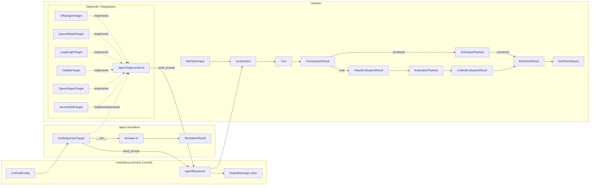

# Types UML — evaluatorq / redteam / agent simulation

Three regions: **evaluatorq core (contracts.py + openresponses)**, **redteam**, **agent simulation**. Shared `AgentResponse` bridges them.

## Class diagram

```mermaid
classDiagram
    %% ============ EVALUATORQ CORE ============
    class LLMCallConfig {
        +str model
        +Literal[chat_completions,responses] api
        +float temperature
        +int max_tokens
        +int timeout_ms
        +dict extra_kwargs
        +Any client
    }
    class AgentResponse {
        +list~OutputMessage~ output
        +text() str
        +tool_calls() list~ToolCallOutputItem~
    }
    class OutputMessage {
        <<Union>>
    }
    class TextOutputItem {
        +Literal[output_text] type
        +str text
        +list annotations
    }
    class ToolCallOutputItem {
        +Literal[function_call] type
        +str name
        +str arguments
        +str id
        +str result
    }
    class ReasoningOutputItem {
        +Literal[reasoning] type
        +str text
        +str id
    }

    OutputMessage <|.. TextOutputItem
    OutputMessage <|.. ToolCallOutputItem
    OutputMessage <|.. ReasoningOutputItem
    AgentResponse "1" *-- "many" OutputMessage
    AgentResponse ..> ToolCallOutputItem : filters in tool_calls

    %% ============ REDTEAM — PROTOCOL + BACKENDS ============
    class AgentTarget {
        <<Protocol>>
        +str memory_entity_id
        +send_prompt(prompt) AgentResponse
        +new() AgentTarget
    }
    class ORQAgentTarget {
        +str agent_key
        +str memory_entity_id
        +send_prompt(prompt) AgentResponse
        +new() ORQAgentTarget
    }
    class OpenAIModelTarget {
        +str model
        +str system_prompt
        +None memory_entity_id
        +send_prompt(prompt) AgentResponse
        +new() OpenAIModelTarget
    }
    class BackendBundle {
        +str name
        +AgentTargetFactory target_factory
        +AgentContextProvider context_provider
        +MemoryCleanup memory_cleanup
        +ErrorMapper error_mapper
    }

    %% ============ REDTEAM — INTEGRATIONS ============
    class LangGraphTarget {
        +str memory_entity_id
        +send_prompt(prompt) AgentResponse
        +new() LangGraphTarget
    }
    class CallableTarget {
        +str memory_entity_id
        +send_prompt(prompt) AgentResponse
        +new() CallableTarget
    }
    class OpenAIAgentTarget {
        +None memory_entity_id
        +send_prompt(prompt) AgentResponse
        +new() OpenAIAgentTarget
    }
    class VercelAISdkTarget {
        +None memory_entity_id
        +str endpoint_url
        +send_prompt(prompt) AgentResponse
        +new() VercelAISdkTarget
    }

    AgentTarget ..> AgentResponse : returns
    ORQAgentTarget ..|> AgentTarget : implements
    OpenAIModelTarget ..|> AgentTarget : implements
    LangGraphTarget ..|> AgentTarget : implements
    CallableTarget ..|> AgentTarget : implements
    OpenAIAgentTarget ..|> AgentTarget : implements
    VercelAISdkTarget ..|> AgentTarget : implements
    BackendBundle o-- AgentTarget

    %% ============ REDTEAM — CONTRACTS ============
    class Message {
        +Literal[user,assistant,tool,system] role
        +str content
        +list~StrategyToolCall~ tool_calls
        +str tool_call_id
        +str name
    }
    class Turn {
        +AttackerResponse attacker
        +AgentResponse target
    }
    class AttackerResponse
    class RedTeamInput {
        +str id
        +str vulnerability
        +str attack_technique
        +str delivery_method
        +Severity severity
        +VulnerabilityDomain vulnerability_domain
        +Framework framework
        +TurnType turn_type
        +str source
    }
    class TokenUsage_RT {
        +int prompt_tokens
        +int completion_tokens
        +int total_tokens
        +int calls
    }
    class OrchestratorResult {
        +list~Message~ conversation
        +int turns
        +bool objective_achieved
        +str final_response
        +TokenUsage token_usage
        +list~list~ToolCallOutputItem~~ tool_calls_per_turn
    }
    class AttackOutput {
        +str category
        +str vulnerability
    }
    class AttackEvaluationResult {
        +bool passed
        +str explanation
        +str evaluator_id
        +TokenUsage token_usage
    }
    class UnifiedEvaluationResult {
        +bool passed
        +str explanation
        +str evaluator_id
        +str evaluator_name
        +TokenUsage token_usage
    }
    class EvaluationPayload {
        +str evaluator_id
        +str evaluator_name
        +bool passed
        +str explanation
        +str error
        +TokenUsage token_usage
    }
    class AttackInfo
    class AttackStrategy
    class RedTeamResult {
        +AttackInfo attack
        +list~Message~ messages
        +UnifiedEvaluationResult evaluation
        +bool vulnerable
        +list tool_calls_per_turn
    }
    class JobOutputPayload {
        +list~Message~ conversation
        +str final_response
        +bool objective_achieved
        +int turns
        +TokenUsage token_usage
        +TokenUsage token_usage_adversarial
        +TokenUsage token_usage_target
        +list~list~ToolCallOutputItem~~ tool_calls_per_turn
        +str error
        +str error_type
        +str finish_reason
    }
    class RedTeamReport {
        +Pipeline pipeline
        +Framework framework
        +list~RedTeamResult~ results
        +ReportSummary summary
    }
    class LLMConfig {
        +LLMCallConfig attacker
        +LLMCallConfig evaluator
        +int retry_count
        +int max_tool_continuations
    }

    Turn *-- AttackerResponse
    Turn *-- AgentResponse
    AttackOutput --|> OrchestratorResult
    OrchestratorResult "1" *-- "many" Message
    OrchestratorResult ..> JobOutputPayload : serialized to
    JobOutputPayload ..> RedTeamResult : converted from
    JobOutputPayload "1" *-- "many" Message
    OrchestratorResult o-- ToolCallOutputItem
    JobOutputPayload o-- ToolCallOutputItem
    AttackEvaluationResult ..> EvaluationPayload : informs
    EvaluationPayload ..> UnifiedEvaluationResult : normalized to
    RedTeamResult *-- AttackInfo
    RedTeamResult *-- UnifiedEvaluationResult
    RedTeamResult o-- ToolCallOutputItem
    RedTeamReport "1" *-- "many" RedTeamResult
    LLMConfig *-- LLMCallConfig
    OrchestratorResult ..> TokenUsage_RT
    RedTeamInput ..> AttackInfo : shapes

    %% ============ AGENT SIMULATION ============
    class OrqResponsesTarget {
        +LLMCallConfig config
        +str instructions
        +list tools
        +str memory_entity_id
        +__call__(messages) str
        +send_prompt(prompt) AgentResponse
        +new() OrqResponsesTarget
    }
    class Persona
    class Scenario
    class Datapoint {
        +str id
        +Persona persona
        +Scenario scenario
        +str user_system_prompt
        +str first_message
    }
    class TurnMetrics
    class Judgment
    class TokenUsage_Sim {
        +int prompt_tokens
        +int completion_tokens
        +int total_tokens
    }
    class SimulationResult {
        +list~Message~ messages
        +TerminatedBy terminated_by
        +bool goal_achieved
        +float goal_completion_score
        +int turn_count
        +TokenUsage_Sim token_usage
        +list~TurnMetrics~ turn_metrics
    }
    class ChatMessage

    OrqResponsesTarget ..|> AgentTarget : implements
    OrqResponsesTarget ..> AgentResponse : produces
    OrqResponsesTarget *-- LLMCallConfig
    Datapoint *-- Persona
    Datapoint *-- Scenario
    SimulationResult o-- TurnMetrics
    SimulationResult ..> TokenUsage_Sim
    TurnMetrics ..> Judgment
```

## Data flow

## Ownership notes

- `AgentResponse`, `OutputMessage` variants, `LLMCallConfig` — central in `evaluatorq.contracts`. Redteam re-exports.
- `TextOutputItem` = alias of `OutputTextContent`. `ToolCallOutputItem` = alias of `FunctionCall`. Both from `evaluatorq.openresponses.convert_models`.
- `AgentTarget` protocol — `redteam/backends/base.py`. Implemented by: `ORQAgentTarget`, `OpenAIModelTarget` (backends), `LangGraphTarget`, `CallableTarget`, `OpenAIAgentTarget`, `VercelAISdkTarget` (integrations), and sim's `OrqResponsesTarget`.
- `BackendBundle` — groups the four backend components (factory, context provider, cleanup, error mapper) for dynamic runtime wiring.
- `Message` — universal conversation unit. Used in `OrchestratorResult`, `JobOutputPayload`, `RedTeamResult`, `SimulationResult`. Supports simple + tool-call + tool-response roles.
- `Turn` — single attacker→target exchange. Immutable (`frozen=True`). Composed into `OrchestratorResult.conversation`.
- `RedTeamInput` — entry point config for one attack sample (vulnerability, technique, severity, framework).
- `AttackOutput` — extends `OrchestratorResult` with `category`/`vulnerability`; produced by job execution before serialization.
- Evaluation chain: `AttackEvaluationResult` → `EvaluationPayload` → `UnifiedEvaluationResult` → stored in `RedTeamResult.evaluation`.
- `JobOutputPayload` — redteam-owned (`redteam/contracts.py`). Wire format between job runner and report builder. Has `extra='allow'` to absorb schema drift.
- Sim `TokenUsage` slim. Redteam `TokenUsage` richer (`calls`, `from_completion`). Distinct types.
- `SendResult` deprecated → alias of `AgentResponse`.
