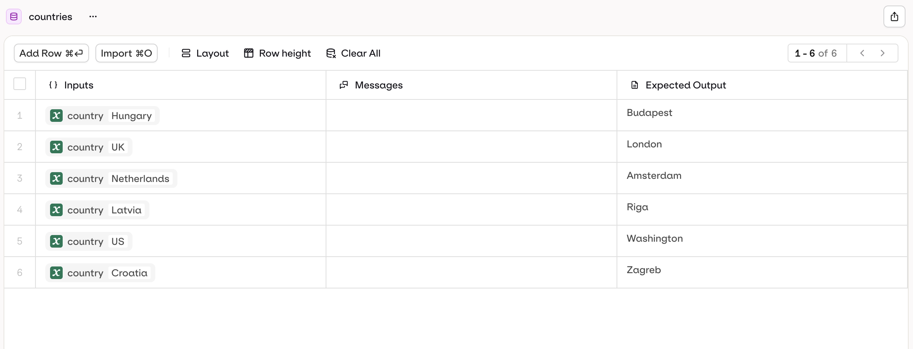
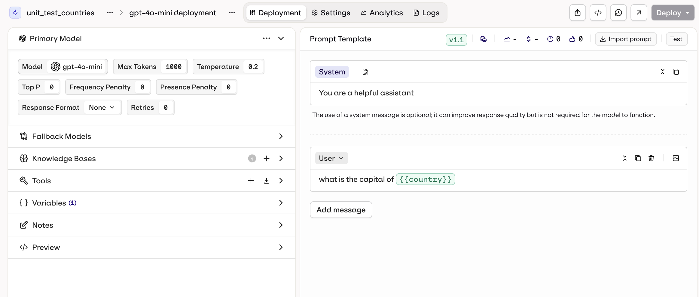

# @orq-ai/evaluatorq Examples

This directory contains examples demonstrating the capabilities of the `@orq-ai/evaluatorq` library.

## Suggested Learning Path

If you're new to evaluatorq, we recommend following this progression:

1. **Start here** — [`pass-fail-simple.ts`](src/lib/basics/pass-fail-simple.ts): Simplest possible evaluation
2. **Add complexity** — [`example-runners.ts`](src/lib/basics/example-runners.ts): Multiple jobs and evaluators
3. **Use datasets** — [`dataset-example.eval.ts`](src/lib/datasets/dataset-example.eval.ts): Load data from the Orq platform
4. **Structured scores** — [`structured-rubric.eval.ts`](src/lib/structured/structured-rubric.eval.ts): Multi-dimensional metrics
5. **Agent integration** — Pick your framework:
   - LangChain: [`langchain-agent-eval.ts`](src/lib/integrations/langchain/langchain-agent-eval.ts)
   - LangGraph: [`langgraph-agent-eval.ts`](src/lib/integrations/langchain/langgraph-agent-eval.ts)
   - Vercel AI SDK: [`vercel_ai_sdk_integration_example.ts`](src/lib/integrations/vercel/vercel_ai_sdk_integration_example.ts)
6. **Advanced patterns** — [`langgraph-research-eval.ts`](src/lib/integrations/langchain/langgraph-research-eval.ts): Dataset-driven agent with `instructions` parameter

## Examples Overview

### Basics

Core examples and entry points in `src/lib/basics/`.

#### [examples.ts](src/lib/basics/examples.ts)
Entry point for running different example types.

#### [example-runners.ts](src/lib/basics/example-runners.ts)
Demonstrates async job processing with simulated LLM responses, context retrieval, and multiple evaluators with realistic delays.

#### [pass-fail-simple.ts](src/lib/basics/pass-fail-simple.ts)
Simple pass/fail evaluation using a calculator job with `matchesExpected` evaluator. Shows how evaluators return `pass: true/false` for CI/CD integration.

#### [eval-reuse.eval.ts](src/lib/basics/eval-reuse.eval.ts)
Demonstrates reusable evaluation patterns:
- Creating reusable evaluator functions (`maxLengthValidator`)
- Defining reusable job functions (`textAnalysisJob`)
- Type-safe evaluation with custom validators
- Using Promise-based data points

#### [llm-eval-with-results.ts](src/lib/basics/llm-eval-with-results.ts)
LLM-based evaluation with structured results using Claude and Orq platform evaluators:
- Multiple jobs (`greet`, `joker`, `calculator`) using Anthropic's Claude API
- ROUGE-N and BERTScore evaluators via the Orq platform
- Length similarity evaluator
- Structured `EvaluationResultCell` scores

#### [test-job-helper.ts](src/lib/basics/test-job-helper.ts)
Demonstrates the `job()` helper's error handling — job names are preserved even when errors occur, and errors are captured in results.

### Datasets

Dataset-based evaluations in `src/lib/datasets/`.

#### [dataset-example.eval.ts](src/lib/datasets/dataset-example.eval.ts)
Shows how to:
- Connect to Orq platform datasets using dataset IDs
- Run multiple parallel jobs on dataset items
- Implement custom evaluators for validation and scoring
- Process evaluation results with summary statistics

#### [country-unit-test.eval.ts](src/lib/datasets/country-unit-test.eval.ts)
A simple "unit test" style example that validates a deployment against an Orq platform dataset:

- Fetches the `countries` dataset from the Orq platform
- Calls the `unit_test_countries` deployment for each country
- Uses the `stringContainsEvaluator` from `@orq-ai/evaluators` to validate responses

**Prerequisites:**

1. Configure a dataset with `country` input variable and expected output:

   

2. Create a deployment that returns the capital city for a given country:

   

### Structured

Structured evaluation results in `src/lib/structured/`. These demonstrate returning multi-dimensional metrics using `EvaluationResultCell`.

#### [structured-rubric.eval.ts](src/lib/structured/structured-rubric.eval.ts)
Multi-criteria quality rubric with sub-scores for relevance, coherence, and fluency.

#### [structured-sentiment.eval.ts](src/lib/structured/structured-sentiment.eval.ts)
Sentiment distribution breakdown across positive, negative, and neutral categories.

#### [structured-safety.eval.ts](src/lib/structured/structured-safety.eval.ts)
Toxicity/safety severity scores with per-category ratings and pass/fail tracking.

#### [path-organization.eval.ts](src/lib/structured/path-organization.eval.ts)
Demonstrates the `path` parameter to organize experiment results into specific projects and folders on the Orq platform (e.g., `"MyProject/Evaluations/Unit Tests"`).

### Integrations

Framework integrations in `src/lib/integrations/`.

#### LangChain / LangGraph

- **[langchain-agent-eval.ts](src/lib/integrations/langchain/langchain-agent-eval.ts)**: Basic LangChain agent evaluation with `wrapLangChainAgent`
- **[langgraph-agent-eval.ts](src/lib/integrations/langchain/langgraph-agent-eval.ts)**: Basic LangGraph compiled graph evaluation with `wrapLangGraphAgent`
- **[langchain-research-eval.ts](src/lib/integrations/langchain/langchain-research-eval.ts)**: Dataset-driven LangChain research agent with dynamic `instructions` via `wrapLangChainAgent` and multi-criteria evaluators (correctness, tool-usage, quality rubric, completeness, city-relevance)
- **[langgraph-research-eval.ts](src/lib/integrations/langchain/langgraph-research-eval.ts)**: Complex multi-tool LangGraph research agent with `instructions` parameter, evaluators for correctness, tool chain, response quality, completeness, and efficiency

#### Vercel AI SDK

- **[vercel_ai_sdk_integration_example.ts](src/lib/integrations/vercel/vercel_ai_sdk_integration_example.ts)**: Basic Vercel AI SDK agent evaluation with `wrapAISdkAgent`
- **[vercel_ai_sdk_dataset_example.ts](src/lib/integrations/vercel/vercel_ai_sdk_dataset_example.ts)**: Dataset-based evaluation of a weather agent, demonstrating `expected_output` comparison, temperature detection, and city mention evaluators
- **[vercel-multi-agent-eval.ts](src/lib/integrations/vercel/vercel-multi-agent-eval.ts)**: Multi-agent evaluation with `instructions` via `wrapAISdkAgent`, scored on correctness, tool usage, quality rubric, and safety

### CLI

CLI integration examples in `src/lib/cli/`.

#### [example-using-cli.eval.ts](src/lib/cli/example-using-cli.eval.ts)
A simple evaluation script that can be run with the Orq CLI. Tests text analysis with expected outputs.

#### [example-using-cli-two.eval.ts](src/lib/cli/example-using-cli-two.eval.ts)
Another CLI-compatible evaluation script demonstrating different test data.

#### [example-llm.eval.ts](src/lib/cli/example-llm.eval.ts)
Demonstrates real LLM integration:
- Uses Anthropic's Claude API for generating greetings
- Shows how to mix synchronous and asynchronous data points
- Implements a name-checking evaluator
- Implements a politeness LLM-based evaluator
- Configurable parallelism for concurrent API calls

#### [example-cosine-similarity.eval.ts](src/lib/cli/example-cosine-similarity.eval.ts)
Demonstrates cosine similarity evaluators from `@orq-ai/evaluators`:
- `simpleCosineSimilarity` for basic semantic comparison
- `cosineSimilarityThresholdEvaluator` with configurable thresholds
- Uses OpenAI embeddings for semantic matching

### Utilities

Shared evaluator utilities in `src/lib/utils/`.

#### [evals.ts](src/lib/utils/evals.ts)
Provides reusable evaluator functions:
- `maxLengthValidator`: Factory function for creating max length validators
- `containsNameValidator`: Evaluator that checks if output contains the input name
- `isItPoliteLLMEval`: LLM-based evaluator that scores politeness (0-1 scale)

## Running Examples

### Prerequisites

For dataset examples, set your Orq API key:
```bash
export ORQ_API_KEY="your-api-key"
```

### Running Individual Examples

```bash
# Basics
bun examples/src/lib/basics/examples.ts
bun examples/src/lib/basics/pass-fail-simple.ts

# Datasets (requires ORQ_API_KEY)
ORQ_API_KEY=... bun examples/src/lib/datasets/dataset-example.eval.ts

# Structured
bun examples/src/lib/structured/structured-rubric.eval.ts

# Integrations (requires OPENAI_API_KEY)
ORQ_API_KEY=... OPENAI_API_KEY=... bun examples/src/lib/integrations/langchain/langgraph-research-eval.ts
ORQ_API_KEY=... OPENAI_API_KEY=... DATASET_ID=... bun examples/src/lib/integrations/vercel/vercel_ai_sdk_dataset_example.ts
ORQ_API_KEY=... OPENAI_API_KEY=... bun examples/src/lib/integrations/vercel/vercel-multi-agent-eval.ts

# CLI (requires Orq CLI)
bunx @orq-ai/cli evaluate "examples/src/lib/cli/example-using-cli.eval.ts"
```

## Key Concepts Demonstrated

1. **Parallel Processing** — All examples use `parallelism` parameter to process multiple data points concurrently, improving performance.
2. **Custom Evaluators** — Examples show various evaluator types: boolean scorers (true/false), numeric scorers (0-1), and string scorers (descriptive results).
3. **Error Handling** — Examples demonstrate graceful error handling with jobs and evaluators that may fail, showing how errors are captured in results.
4. **Type Safety** — All examples use TypeScript for full type safety with `DataPoint`, `Job`, and `Evaluator` types.
5. **Real-world Patterns** — Simulated API calls with delays, text analysis and transformation, data validation and quality scoring, integration with external platforms.

## Common Patterns and Tips

- **Evaluator returns**: Use `value: number` (0-1) for scores, `value: boolean` for pass/fail, or `EvaluationResultCell` for structured multi-dimensional metrics
- **CI/CD integration**: Return `pass: true/false` from evaluators — the process exits with code 1 if any evaluator fails
- **Dashboard organization**: Use the `path` parameter (e.g., `path: "Team/Sprint/Feature"`) to keep experiments organized on the Orq platform
- **Rate limiting**: Set `parallelism` to a low value (3-5) when calling external APIs to avoid rate limits
- **Error debugging**: Always use the `job()` helper instead of raw functions — it preserves job names in error messages
- **OpenResponses format**: Integration wrappers (`wrapLangChainAgent`, `wrapAISdkAgent`) automatically convert agent outputs to the standardized OpenResponses format for evaluation

## Notes

- The `evaluatorq` function returns detailed results including job outputs and evaluator scores
- Set `print: true` to display a formatted table of results in the console
- All async operations are properly handled with Promise support